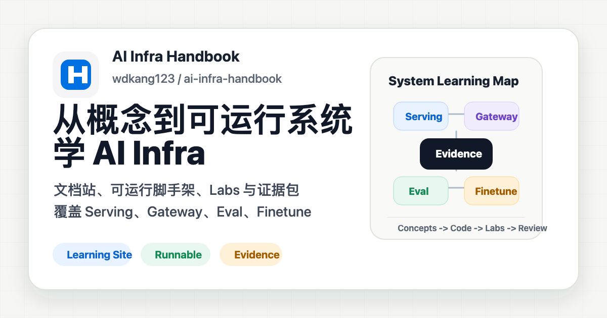
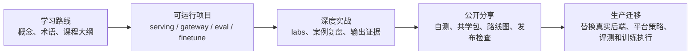
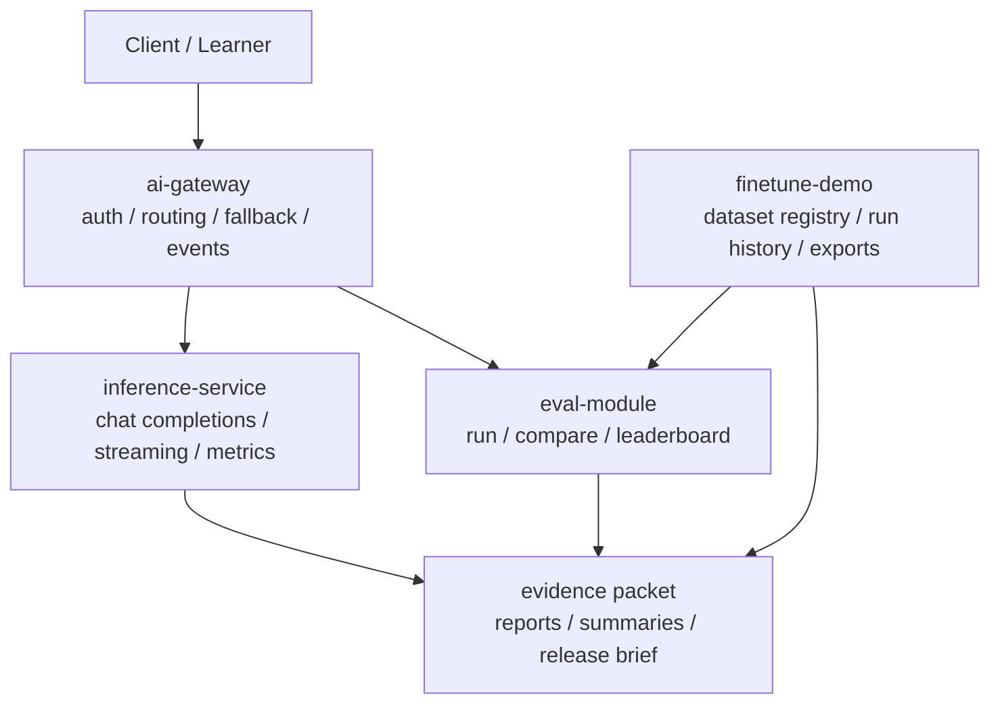

# AI Infra Handbook

[](https://github.com/wdkang123/ai-infra-handbook/actions/workflows/ci.yml)
[](https://github.com/wdkang123/ai-infra-handbook/actions/workflows/docs-pages.yml)
[](./LICENSE)



> 一套能边学边跑的 AI 基础设施学习手册：从 LLM 请求链路、推理服务、AI Gateway、评测观测到微调资产化，用文档站、可运行代码、hands-on labs 和证据包把学习过程连起来。

**English summary:** AI Infra Handbook is a public learning handbook for backend, platform, and AI application developers. It is not a production platform. The project combines structured docs, four runnable learning services, hands-on labs, request evidence, eval reports, training manifests, and a migration roadmap toward vLLM, SGLang, OpenTelemetry GenAI, Prometheus metrics, and eval release gates.

这个仓库现在的主目标，不是做一个花哨产品，而是把 AI Infra 的学习内容、可运行脚手架和最小联调链路收成一套能边学边跑的手册。

当前定位：

- 学习项目，不是生产平台
- 文档站 + 可运行代码 + hands-on labs
- 面向公开分享、学习小组和 GitHub 贡献
- MIT License，欢迎基于学习和教学目的复用

你可以把它理解成三条并行主线：

1. 文档线：沉淀结构化学习手册
2. 项目线：同步维护 `inference-service`、`ai-gateway`、`eval-module`、`finetune-demo`
3. 实战线：用 hands-on labs 把概念、代码、命令、产物和验收串起来

## 适合谁

- 想系统理解 AI Infra，而不是只零散看模型 API 的学习者
- 想把 inference serving、gateway、evaluation、finetuning 串成工程闭环的开发者
- 想组织学习小组、公开分享或带练 AI Infra 主题的讲师/维护者
- 想从学习型 mock 系统逐步迁移到真实 serving、评测和训练栈的工程实践者

## 项目地图





## 现在最推荐怎么开始

如果你准备跟着文档一步步学，最推荐顺序是：

1. [15 分钟 Quickstart](./docs/quickstart/15-minute-demo.md)
2. [从 0 到 1 学习路径](./docs/00-overview/00-zero-to-one.md)
3. [什么是 AI Infra](./docs/00-overview/01-what-is-ai-infra.md)
4. [学习路线图](./docs/00-overview/02-learning-route.md)
5. [课程大纲](./docs/00-overview/12-course-syllabus.md)
6. [项目成熟度地图](./docs/00-overview/14-project-maturity-map.md)
7. [两周学习计划](./docs/00-overview/15-two-week-learning-plan.md)
8. [最小运行手册](./docs/00-overview/03-runbook.md)
9. [第一次实操演练](./docs/00-overview/04-first-walkthrough.md)
10. [第一次跑完之后学什么](./docs/00-overview/06-after-first-walkthrough.md)
11. [深度实战总览](./docs/07-hands-on-labs/00-overview.md)
12. [案例复盘总览](./docs/11-case-studies/00-overview.md)
13. [示例输出与证据库](./docs/13-output-gallery/00-overview.md)
14. [共学与公开分享套件](./docs/14-workshop-kit/00-overview.md)
15. [生产迁移路线总览](./docs/12-production-migration/00-overview.md)
16. [学习自测总览](./docs/10-assessments/00-overview.md)
17. [参考资料总览](./docs/09-reference/00-overview.md)

如果你更想直接按模块学，再看：

- [项目学习总览](./docs/06-projects/00-projects-overview.md)
- [AI Infra 入门](./docs/landing/ai-infra-intro.md)
- [AI Gateway](./docs/landing/ai-gateway.md)
- [LLM Observability](./docs/landing/llm-observability.md)
- [LLM Evaluation](./docs/landing/llm-evaluation.md)
- [Production Migration](./docs/landing/production-migration.md)
- [文档与项目怎么联动](./docs/06-projects/05-docs-and-projects-map.md)
- [面向分享的学习方式](./docs/00-overview/11-public-learning-guide.md)
- [项目成熟度地图](./docs/00-overview/14-project-maturity-map.md)
- [两周学习计划](./docs/00-overview/15-two-week-learning-plan.md)
- [案例复盘总览](./docs/11-case-studies/00-overview.md)
- [示例输出与证据库](./docs/13-output-gallery/00-overview.md)
- [共学与公开分享套件](./docs/14-workshop-kit/00-overview.md)
- [自动生成共学包](./docs/14-workshop-kit/07-generated-workshop-packet.md)
- [生产迁移路线总览](./docs/12-production-migration/00-overview.md)
- [自动生成路线图包](./docs/08-publication/05-generated-roadmap-pack.md)
- [术语索引](./docs/00-overview/13-glossary.md)
- [学习自测总览](./docs/10-assessments/00-overview.md)
- [自动生成测评包](./docs/10-assessments/06-generated-assessment-pack.md)
- [命令速查](./docs/09-reference/01-command-cheatsheet.md)
- [API Surface 速查](./docs/09-reference/05-api-surface.md)
- [CLI Surface 速查](./docs/09-reference/06-cli-surface.md)
- [验证矩阵](./docs/09-reference/07-validation-matrix.md)
- [课程目录生成器](./docs/09-reference/10-course-catalog.md)
- [常见排障手册](./docs/09-reference/04-troubleshooting.md)

如果你准备把它分享给别人，建议先完成：

- [系统 Capstone 与验收 Rubric](./docs/07-hands-on-labs/05-capstone-review-rubric.md)
- [公开发布验收 Lab](./docs/07-hands-on-labs/06-public-release-readiness-lab.md)
- [共学与公开分享套件](./docs/14-workshop-kit/00-overview.md)
- [自动生成共学包](./docs/14-workshop-kit/07-generated-workshop-packet.md)
- [自动生成测评包](./docs/10-assessments/06-generated-assessment-pack.md)
- [自动生成路线图包](./docs/08-publication/05-generated-roadmap-pack.md)
- [自动生成首发运营包](./docs/08-publication/13-generated-launch-pack.md)
- [公开发布总览](./docs/08-publication/00-overview.md)
- [GitHub 仓库设置建议](./docs/08-publication/04-repository-settings.md)
- [依赖维护与 Bot PR 处理](./docs/08-publication/07-dependency-maintenance.md)
- [维护节奏与运营清单](./docs/08-publication/08-maintainer-rhythm.md)
- [Issue 分类与标签策略](./docs/08-publication/09-issue-triage-and-labels.md)
- [v0.1 首发发布手册](./docs/08-publication/10-v0-1-release-playbook.md)
- [首批公开 Issues 草稿](./docs/08-publication/11-first-public-issues.md)
- [v0.1 Release Notes 草稿](./docs/08-publication/12-v0-1-release-notes-draft.md)
- [Starter Issues](./docs/08-publication/15-starter-issues.md)
- [v0.1.0 Release Notes](./docs/08-publication/16-v0-1-release-notes.md)
- [社区贡献路径](./docs/community/00-overview.md)
- [First PR Playbook](./docs/community/01-first-pr-playbook.md)
- [公开数据与证据规范](./docs/community/02-safe-data-and-evidence.md)
- [维护者 Triage 节奏](./docs/community/03-triage-and-maintainer-rhythm.md)
- [Publication Checklist](./PUBLICATION_CHECKLIST.md)

## 15 分钟 Quickstart

第一次 clone 后，推荐先跑：

```bash
python3 -m venv .venv
PYTHON=.venv/bin/python make quickstart
```

这会完成安装、跨服务 smoke、证据包生成，并启动本地 inference / gateway 服务。随后可以按 [15 分钟 Quickstart](./docs/quickstart/15-minute-demo.md) 手动发送请求、查看 request id、events、metrics，并生成 evidence packet。

## 文档站

这套 Markdown 已经可以直接挂成一个本地学习站：

```bash
nvm use
npm install
npm run docs:dev
```

`nvm use` 会读取仓库里的 `.nvmrc`，当前推荐 Node 22。

然后打开：

- `http://localhost:5173`

如果你想构建静态站：

```bash
npm run docs:build
npm run docs:preview
```

如果你准备部署到 GitHub Pages，请看：

- [GitHub Pages 发布指南](./docs/08-publication/01-github-pages.md)

## 质量检查

第一次准备开发时，先装 Python 项目依赖和开发工具：

```bash
PYTHON=.venv/bin/python make infra-dev-install
```

如果你想记录本地端口或配置路径，可以参考 `.env.example`。  
真实 `.env` 文件已被 `.gitignore` 忽略，不要把真实密钥写进仓库。

日常改完代码和文档后，先跑：

```bash
PYTHON=.venv/bin/python make infra-check
```

这会检查 Python lint、四个项目的单元测试、文档质量检查，以及文档站构建。

公开上传或发 PR 前，建议先跑安全检查：

```bash
PYTHON=.venv/bin/python make security-check
```

它只扫描 Git 候选入库文件，重点检查高置信密钥、私钥、连接串、本机路径、个人痕迹和不适合公开提交的文件类型。

如果你想用一条命令完成公开上传前的主要检查，可以跑：

```bash
PYTHON=.venv/bin/python make public-check
```

这会先跑 `security-check`，再跑 `infra-check`。

改到跨服务链路时，再跑：

```bash
PYTHON=.venv/bin/python make infra-smoke
```

如果你想把本轮 smoke 输出整理成可分享的复盘材料，再跑：

```bash
PYTHON=.venv/bin/python make infra-evidence
```

如果你想把学习站结构整理成可分享的课程地图，再跑：

```bash
PYTHON=.venv/bin/python make docs-inventory
```

如果你想把课程主线整理成可带练模块，再跑：

```bash
PYTHON=.venv/bin/python make course-catalog
```

如果你想把课程地图和运行证据合成公开发布摘要，再跑：

```bash
PYTHON=.venv/bin/python make release-brief
```

如果你想把课程目录和发布摘要整理成可带练共学包，再跑：

```bash
PYTHON=.venv/bin/python make workshop-packet
```

如果你想把课程模块整理成可测评题目、证据要求和评分标准，再跑：

```bash
PYTHON=.venv/bin/python make assessment-pack
```

如果你想把发布摘要和测评弱点整理成首批 GitHub issue 种子，再跑：

```bash
PYTHON=.venv/bin/python make roadmap-pack
```

如果你想把 release notes、首批 issue、标签规范和发布后检查表整理成首发运营包，再跑：

```bash
PYTHON=.venv/bin/python make launch-pack
```

## 当前项目状态

当前四个项目已经形成最小可运行闭环：

1. `inference-service`：最小服务骨架、`/health`、`/metrics`、可按事件类型/请求/模型过滤的 `/events`、`/events/summary`、`/events/requests`、`/events/requests/{request_id}`、`/v1/models`、`/v1/chat/completions`、最小 `stream=true` SSE、`x-request-id`、OpenAI-compatible engine adapter、结构化错误语义、mock token usage 估算
2. `ai-gateway`：鉴权、模型路由、模型列表、代理、限流、最小 streaming 透传、`x-request-id` 贯穿、最小 upstream 健康探测、默认 fallback 示例、fallback metrics、可过滤的 `/events`、`/events/summary`、`/events/failures`、`/events/requests` 和 `/events/requests/{request_id}` 结构化事件、`x-upstream-model` / `x-fallback-used` / `x-cache` 可观察 header
3. `eval-module`：`run / compare / leaderboard / list-runs / list-comparisons / list-tasks` CLI、runner factory、JSON/Markdown 报告、run/comparison bundle、sample outputs、sample summary、sample analysis、history 落盘、带 task summaries 的 run index、comparison index verdict/recommendation/task 聚合、带 backend/few-shot 过滤和分组视图的最小 leaderboard、best/latest 文件追踪、最小阈值、task 一致性校验、release recommendation
4. `finetune-demo`：`train / save / export / list-runs / list-datasets / diff-datasets / list-exports` CLI、mock 训练产物、run/export manifest、checkpoint index、artifacts bundle、history、数据集结构校验、dataset registry 查询/过滤/重复统计/diff、dataset version、dataset role stats、trainer/export lineage、带 run/checkpoint manifest pointer 和 model/dataset summaries 的 run index、带 export manifest pointer/status/duration/model/dataset summaries 的 export index

根级 `Makefile` 和 smoke 也已经能打通 `gateway / inference / eval / finetune` 的最小联调链路。
另外，`scripts/docs_quality_check.py` 会检查 Markdown 内链与 heading 锚点、H1 结构、VitePress nav/sidebar 路由、首页配置与 Vue 组件链接、README 关键入口和首页文档页统计，避免文档站在持续扩展中慢慢漂移。
`scripts/build_evidence_packet.py` 会把 `.tmp/smoke` 里的服务快照、eval 报告和 finetune 产物汇总成 JSON / Markdown 证据包，方便公开演示和 PR 复盘。
`scripts/build_learning_inventory.py` 会扫描 `docs/`，把章节、页面、课程主线、内容信号和 Makefile 目标汇总成 JSON / Markdown 学习站清单，方便 GitHub 发布、共学带练和课程维护。
`scripts/build_course_catalog.py` 会读取学习站清单，把 7 条主线整理成 JSON / Markdown 课程目录，方便讲师、学习小组和公开演示复用同一份带练材料。
`scripts/build_release_brief.py` 会把学习站清单和证据包合成 JSON / Markdown 发布摘要，方便 GitHub 首发、PR 复盘和公开演示。
`scripts/build_workshop_packet.py` 会把课程目录和发布摘要合成 JSON / Markdown 共学包，方便讲师安排议程、拆分模块、布置学习者交付和收集复盘问题。
`scripts/build_assessment_pack.py` 会把课程目录和共学包合成 JSON / Markdown 测评包，方便按模块生成题目、证据要求、rubric 和 Capstone 追问。
`scripts/build_roadmap_pack.py` 会把发布摘要和测评包合成 JSON / Markdown 路线图包，方便整理首批 GitHub issue 种子、推荐 label、验收标准和验证命令。
`scripts/build_launch_pack.py` 会把发布摘要和路线图包合成 JSON / Markdown 首发运营包，方便统一 release notes、starter issues、默认标签规范和发布后复盘清单。

## 深度实战

为了让这个仓库更适合公开学习和分享，文档站现在新增了 5 个 lab：

1. [Serving 可观测性 Lab](./docs/07-hands-on-labs/01-serving-observability-lab.md)
2. [Gateway 韧性 Lab](./docs/07-hands-on-labs/02-gateway-resilience-lab.md)
3. [Eval 发布门禁 Lab](./docs/07-hands-on-labs/03-eval-release-gate-lab.md)
4. [Finetune 复现资产 Lab](./docs/07-hands-on-labs/04-finetune-reproducibility-lab.md)
5. [系统 Capstone 与验收 Rubric](./docs/07-hands-on-labs/05-capstone-review-rubric.md)
6. [公开发布验收 Lab](./docs/07-hands-on-labs/06-public-release-readiness-lab.md)

这些 lab 的目标不是堆更多概念，而是让读者能按任务完成观察、改动、验证和复盘。

## 学习自测

为了让这个学习站更适合分享给别人，文档站新增了一组阶段自测：

- [系统地图自测](./docs/10-assessments/01-system-map-check.md)
- [Serving 与 Gateway 自测](./docs/10-assessments/02-serving-gateway-quiz.md)
- [Eval 与 Finetune 自测](./docs/10-assessments/03-eval-finetune-quiz.md)
- [Capstone 答辩稿](./docs/10-assessments/04-capstone-defense.md)
- [参考答案与讲解](./docs/10-assessments/05-answer-key.md)
- [自动生成测评包](./docs/10-assessments/06-generated-assessment-pack.md)

这些自测用于判断读者是否已经能讲清系统边界、请求链路、失败路径、产物复现和下一步改进方案。

## 案例复盘

为了让读者不只会读概念和跑命令，文档站新增了一组跨项目案例：

- [请求失败排查案例](./docs/11-case-studies/01-request-incident-walkthrough.md)
- [模型发布判断案例](./docs/11-case-studies/02-model-release-decision-walkthrough.md)
- [训练产物复现案例](./docs/11-case-studies/03-finetune-to-eval-asset-lineage.md)

这些案例把 request id、事件摘要、eval sample analysis、comparison、checkpoint index、dataset registry 和 export lineage 串成可以复盘的工程故事。

## 示例输出与证据库

为了让读者跑完命令后知道“该看什么、怎么看、怎么复盘”，文档站新增了一组输出证据页面：

- [示例输出与证据库总览](./docs/13-output-gallery/00-overview.md)
- [Serving 与 Gateway 输出证据](./docs/13-output-gallery/01-serving-gateway-evidence.md)
- [Eval 报告证据](./docs/13-output-gallery/02-eval-report-evidence.md)
- [Finetune 产物证据](./docs/13-output-gallery/03-finetune-artifact-evidence.md)
- [端到端复盘证据包](./docs/13-output-gallery/04-end-to-end-review-packet.md)
- [失败症状到证据地图](./docs/13-output-gallery/05-failure-evidence-map.md)
- [公开演示脚本](./docs/13-output-gallery/06-public-demo-script.md)
- [自动生成证据包](./docs/13-output-gallery/07-generated-evidence-packet.md)

这些页面补上了公开学习站最容易缺的一层：不只告诉读者怎么跑，还告诉读者哪些输出能作为工程证据，并且可以用 `make infra-evidence` 自动生成一份复盘材料。

## 共学与公开分享套件

为了让这个项目更适合发到 GitHub、组织学习小组、做公开演示和吸收贡献，文档站新增了一组共学材料：

- [共学与公开分享套件总览](./docs/14-workshop-kit/00-overview.md)
- [讲师与带练指南](./docs/14-workshop-kit/01-facilitator-guide.md)
- [学习者工作簿](./docs/14-workshop-kit/02-learner-workbook.md)
- [学习小组议程](./docs/14-workshop-kit/03-study-group-agenda.md)
- [复盘与评审模板](./docs/14-workshop-kit/04-review-templates.md)
- [贡献者协作手册](./docs/14-workshop-kit/05-contribution-playbook.md)
- [GitHub 发布计划](./docs/14-workshop-kit/06-github-release-plan.md)
- [自动生成共学包](./docs/14-workshop-kit/07-generated-workshop-packet.md)
- [自动生成测评包](./docs/10-assessments/06-generated-assessment-pack.md)
- [自动生成路线图包](./docs/08-publication/05-generated-roadmap-pack.md)
- [自动生成首发运营包](./docs/08-publication/13-generated-launch-pack.md)

这些页面把“个人自学”继续推进成“可以带别人学、可以收反馈、可以持续迭代”的公开项目形态。

## 生产迁移路线

如果你已经跑通学习型闭环，下一步可以看：

- [生产迁移路线总览](./docs/12-production-migration/00-overview.md)
- [Serving 后端迁移](./docs/12-production-migration/01-serving-backend-migration.md)
- [Gateway 平台化加固](./docs/12-production-migration/02-gateway-platform-hardening.md)
- [Eval 评测系统迁移](./docs/12-production-migration/03-eval-judge-dashboard-migration.md)
- [Finetune 真实训练迁移](./docs/12-production-migration/04-finetune-real-training-migration.md)
- [vLLM Adapter 设计](./docs/12-production-migration/05-vllm-adapter-design.md)
- [OpenTelemetry GenAI Tracing 设计](./docs/12-production-migration/06-opentelemetry-genai-tracing.md)
- [Prometheus Metrics 对照表](./docs/12-production-migration/07-prometheus-metrics-map.md)
- [SGLang 迁移对比](./docs/12-production-migration/08-sglang-migration-notes.md)

这些页面不会把当前项目说成生产平台，而是说明如何保留接口、观测、manifest 和验证，再逐步替换真实后端、平台策略、judge/dashboard 和训练执行。

## 参考资料

为了让读者在学习中少迷路，文档站也补了一组随查随用的参考页：

- [命令速查](./docs/09-reference/01-command-cheatsheet.md)
- [概念到代码索引](./docs/09-reference/02-concept-to-code-index.md)
- [产物与文件索引](./docs/09-reference/03-artifacts-and-files.md)
- [常见排障手册](./docs/09-reference/04-troubleshooting.md)
- [API Surface 速查](./docs/09-reference/05-api-surface.md)
- [CLI Surface 速查](./docs/09-reference/06-cli-surface.md)
- [验证矩阵](./docs/09-reference/07-validation-matrix.md)
- [学习站清单生成器](./docs/09-reference/08-learning-inventory.md)
- [发布摘要生成器](./docs/09-reference/09-release-brief.md)
- [课程目录生成器](./docs/09-reference/10-course-catalog.md)
- [自动生成共学包](./docs/14-workshop-kit/07-generated-workshop-packet.md)
- [自动生成测评包](./docs/10-assessments/06-generated-assessment-pack.md)
- [自动生成路线图包](./docs/08-publication/05-generated-roadmap-pack.md)
- [自动生成首发运营包](./docs/08-publication/13-generated-launch-pack.md)

## 仓库结构

- `docs/`：学习手册正文和文档站内容
- `projects/`：项目代码与实验
- `scripts/`：质量检查、证据包、课程目录和发布材料生成器
- `tasks/`：脱敏后的任务卡、研究记录、评审记录和演进工作台
- `prompts/`：脱敏后的 AI 协作提示词和任务执行模板
- `.github/`：CI、Pages workflow、issue templates 和 PR template
- `llms.txt` / `docs/public/llms.txt`：面向搜索、AI 工具和公开分享的核心入口清单
- `PUBLICATION_CHECKLIST.md`：公开发布前检查清单
- `SECURITY.md`：安全边界、密钥处理约定和报告方式

为了让公开仓库既丰富又安全，任务卡和提示词可以在脱敏后公开；临时交接文档、个人本机路径、运行输出、缓存、模型权重、日志和真实 `.env` 不会作为公开内容提交。对应规范见 [公开仓库卫生规范](./docs/08-publication/06-public-repo-hygiene.md)。

## 贡献和发布

- [贡献指南](./CONTRIBUTING.md)
- [行为准则](./CODE_OF_CONDUCT.md)
- [安全说明](./SECURITY.md)
- [公开发布清单](./PUBLICATION_CHECKLIST.md)
- [更新日志](./CHANGELOG.md)
- [MIT License](./LICENSE)
- [内容写作规范](./docs/08-publication/02-content-style-guide.md)
- [公开路线图](./docs/08-publication/03-public-roadmap.md)
- [GitHub 仓库设置建议](./docs/08-publication/04-repository-settings.md)
- [维护节奏与运营清单](./docs/08-publication/08-maintainer-rhythm.md)
- [Issue 分类与标签策略](./docs/08-publication/09-issue-triage-and-labels.md)
- [v0.1 首发发布手册](./docs/08-publication/10-v0-1-release-playbook.md)
- [首批公开 Issues 草稿](./docs/08-publication/11-first-public-issues.md)
- [v0.1 Release Notes 草稿](./docs/08-publication/12-v0-1-release-notes-draft.md)
- [Starter Issues](./docs/08-publication/15-starter-issues.md)
- [v0.1.0 Release Notes](./docs/08-publication/16-v0-1-release-notes.md)
- [社区贡献路径](./docs/community/00-overview.md)
- [First PR Playbook](./docs/community/01-first-pr-playbook.md)
- [公开数据与证据规范](./docs/community/02-safe-data-and-evidence.md)
- [维护者 Triage 节奏](./docs/community/03-triage-and-maintainer-rhythm.md)
- [自动生成首发运营包](./docs/08-publication/13-generated-launch-pack.md)

## 当前状态

按公开分享目标来看，这套仓库已经从“可正式开始系统学习”推进到“公开增长态”的前半段：

- 学习手册主干已经收齐
- 本地文档站已经可用
- 四个项目的最小可运行闭环已经打通
- 15 分钟 Quickstart 已经成为第一入口
- 文档、代码、运行入口已经基本对齐
- 课程大纲、项目成熟度地图、两周学习计划、发布前验收 Lab 已经能支撑公开分享前的自查
- 示例输出与证据库已经能支撑读者按输出证据做复盘和公开演示
- 共学与公开分享套件已经能支撑学习小组、公开演示、贡献协作和 GitHub 首发计划
- v0.1.0 release notes、starter issues、community path、First PR Playbook、公开数据与证据规范、维护者 Triage 节奏、landing pages 和 `llms.txt` 已经补齐公开增长入口
- vLLM、SGLang、OpenTelemetry GenAI、Prometheus metrics 和 Eval release gate 已经有迁移设计锚点
- release brief 已经能把 eval recommendation 映射成 pass / warn / block 的公开发布风险

所以你现在完全可以直接按文档开始学，而不是再等仓库继续长。

## 下一阶段会做什么

后续如果继续推进，重点会更偏向“真实 AI Infra 小步迁移”和“公开反馈回流”：

- 把 vLLM adapter 从设计页推进到可选实现，同时保留 mock 默认路径
- 给 gateway / inference 增加 OpenTelemetry GenAI tracing 的版本化映射
- 把当前 metrics 和真实 vLLM / SGLang runtime metrics 对齐到 Prometheus 观察清单
- 把 eval release gate 继续接入 evidence packet、CI release check 和发布 PR 模板
- 把 starter issues 转成 GitHub issues，并根据读者反馈持续拆小
- 继续补真实失败案例、lab 和 evidence packet，让内容从“能读”继续变成“能验证、能贡献”
